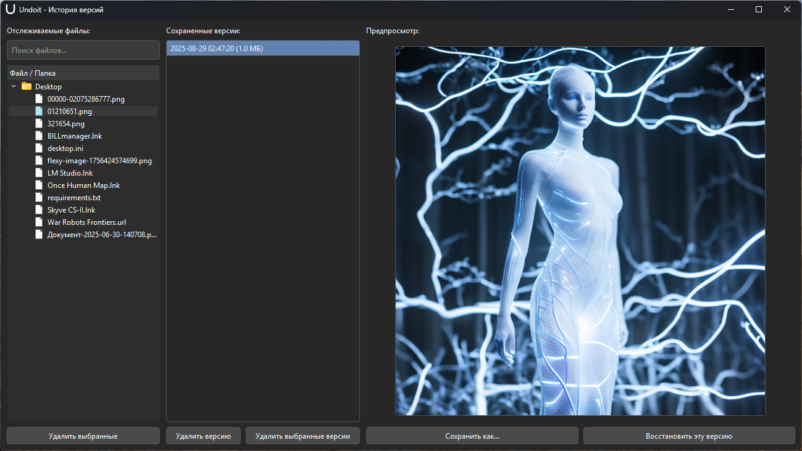
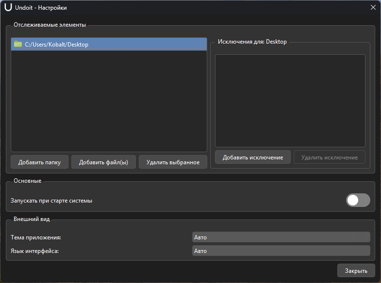
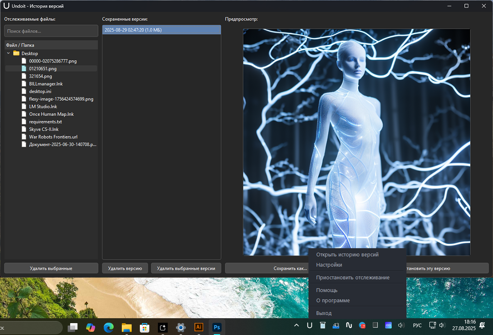

# Справка по программе Undoit

Добро пожаловать в Undoit! Эта программа создана для автоматического сохранения версий ваших файлов, чтобы вы никогда не потеряли важные изменения.

## Как это работает?

Undoit работает в фоновом режиме и следит за файлами в указанных вами папках. Как только вы сохраняете изменения в одном из отслеживаемых файлов, программа тут же создает его копию и помещает в свое безопасное хранилище.

Вы можете в любой момент просмотреть историю изменений и восстановить любую из предыдущих версий.

## Основные возможности

### 1. Окно "История версий"

Это главный экран программы, который открывается по клику на иконку в трее. Он разделен на три части:

*   **Отслеживаемые файлы (слева)**: Список всех файлов, для которых сохранена хотя бы одна версия. Используйте поиск, чтобы быстро найти нужный файл.
*   **Сохраненные версии (в центре)**: Когда вы выбираете файл слева, здесь появляется список всех его сохраненных копий, отсортированных от самой новой к самой старой.
*   **Предпросмотр (справа)**: Здесь отображается содержимое выбранной версии файла. Для бинарных файлов (картинки, архивы) предпросмотр недоступен.

### 2. Восстановление файлов

У вас есть два способа восстановить старую версию:

*   **"Сохранить как..."**: Этот способ безопасен. Он позволяет сохранить выбранную старую версию как новый файл в любом удобном для вас месте, не затрагивая текущий рабочий файл.
*   **"Восстановить эту версию"**: **Внимание!** Эта кнопка перезаписывает ваш текущий файл выбранной старой версией. Перед этим Undoit попытается сохранить последнее состояние вашего файла в историю, но всегда используйте эту функцию с осторожностью.

### 3. Настройки

Окно настроек открывается по двойному клику на иконку в трее или через меню.

*   **Отслеживаемые элементы**: Здесь вы управляете тем, за какими файлами и папками следит программа. Вы можете добавлять отдельные файлы или целые папки.
*   **Исключения для папки**: Если вы добавили папку, но хотите, чтобы программа игнорировала определенную подпапку внутри нее (например, `node_modules` или `.git`), вы можете добавить ее в исключения.
*   **Основные**: Здесь можно включить или выключить автозапуск программы вместе с Windows.
*   **Внешний вид**: Выбор темы (светлая/темная) и языка интерфейса.

### 4. Иконка в системном трее

Иконка показывает текущее состояние программы:

*   **Обычная (контур)**: Программа активна и следит за файлами.
*   **Закрашенная (акцентный цвет)**: Программа производит сканирование файлов.
*   **Серая**: Мониторинг приостановлен (по вашему выбору).
*   **Красная**: Происходит операция очистки истории.
*   **Фиолетовая**: Мониторинг неактивен (например, не указаны папки для отслеживания).

**Быстрые действия с иконкой:**

*   **Одиночный клик левой кнопкой**: Открыть историю версий.
*   **Двойной клик левой кнопкой**: Открыть настройки.
*   **Клик средней кнопкой**: Приостановить/возобновить отслеживание.
*   **Клик правой кнопкой**: Открыть контекстное меню.