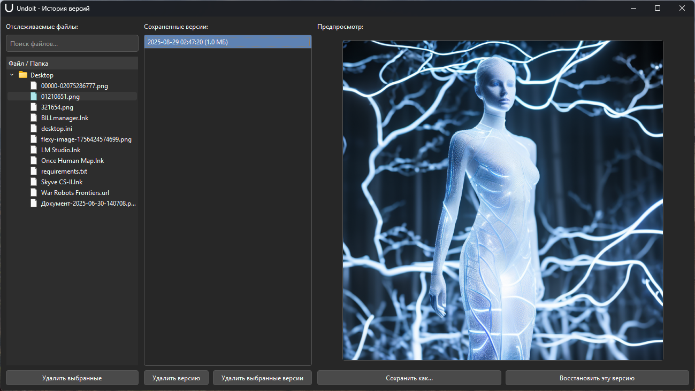

# Никогда больше не теряйте изменения в файлах

**Undoit — это ваш персональный страж версий, работающий в фоне.**

Undoit — это легковесная утилита для Windows, которая автоматически отслеживает изменения в указанных вами файлах и папках. Как только вы сохраняете файл, Undoit создает его защищенную копию, позволяя вам в любой момент откатиться к предыдущей версии, сравнить изменения или восстановить утерянные данные.

[<i class="fa-solid fa-download"></i> Скачать](https://github.com/kobaltgit/Undoit/releases/download/v1.0.0/Undoit.zip){ .md-button }